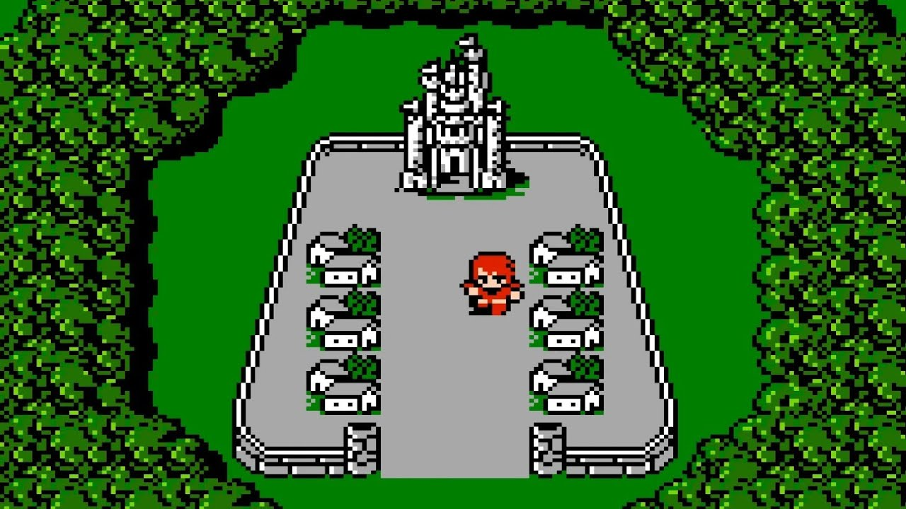
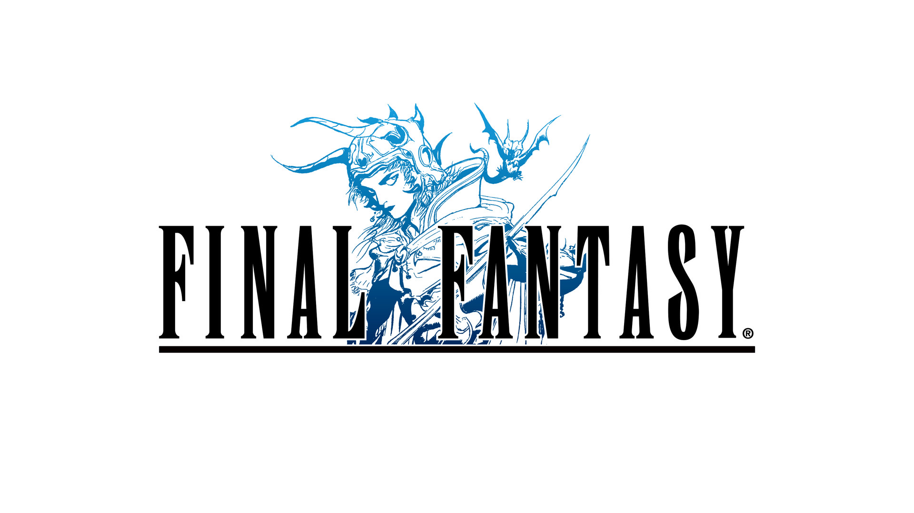
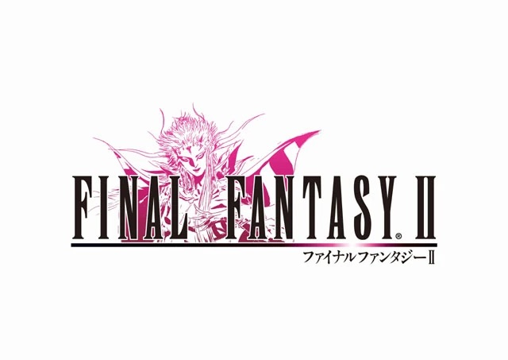
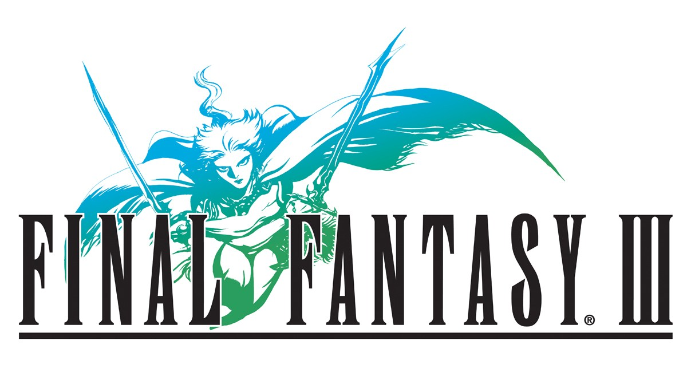
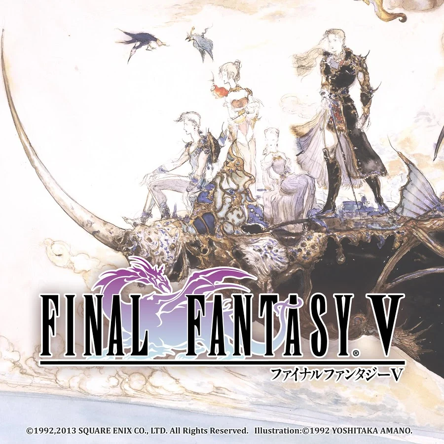
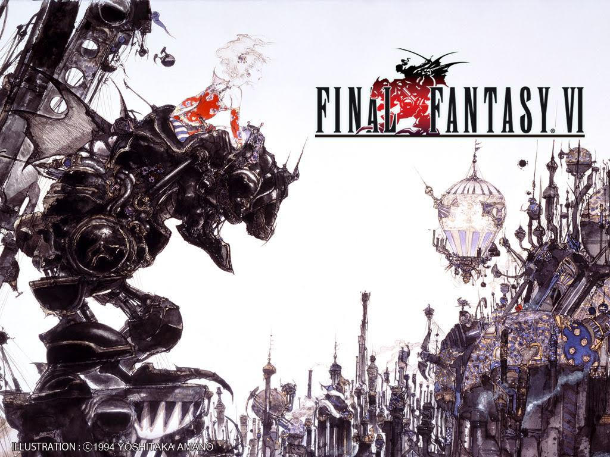
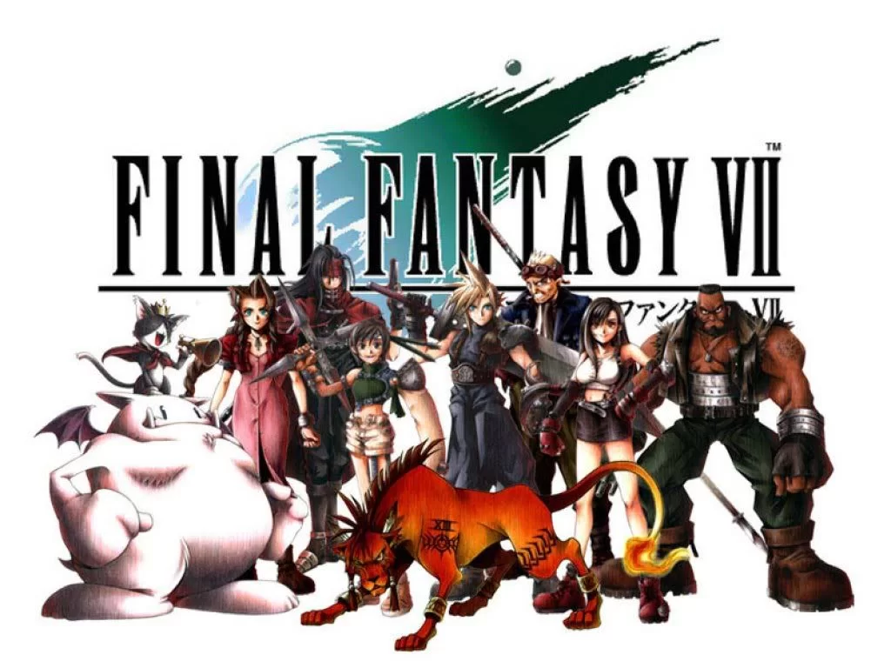

Nous partons sur un choix de l'histoire de la licence du jeux vidéo Japonais _Final Fantasy_ 

## Du RPG au A-RPG

- Final Fantasy I, le jeu de la dernière chance !

  
 
- Final Fantasy IV, le tournant de l'ATB
- Final Fantasy VI, un jeu pour adultes ?
- Final Fantasy VII, la 3D au service d'une nouvelle console 

### La première décennie en images 

  

    <label for="slide-dot-1"></label>
    <label for="slide-dot-2"></label>
    <label for="slide-dot-3"></label>
    <label for="slide-dot-4"></label>
    <label for="slide-dot-5"></label>
    <label for="slide-dot-6"></label>
    <label for="slide-dot-7"></label>
  

      
  <input class="slide-input" id="slide-dot-1" type="radio" name="slides" checked>
  

  <input class="slide-input" id="slide-dot-2" type="radio" name="slides">
  
      
  <input class="slide-input" id="slide-dot-3" type="radio" name="slides">
  

  <input class="slide-input" id="slide-dot-4" type="radio" name="slides">
  

  <input class="slide-input" id="slide-dot-5" type="radio" name="slides">
  

  <input class="slide-input" id="slide-dot-6" type="radio" name="slides">
  

  <input class="slide-input" id="slide-dot-7" type="radio" name="slides">
  

 

### 1997 : La console PlayStation

- A l'arrivé de Final Fantasy 7 sur PlayStation, la licence prend un tournant commercial et le développement à l'internationnal de _FF_ donnera un nouvel essor pour la décennie à suivre. 

<audio controls preload="auto" loop muted>
    <source src="https://www.youtube.com/watch?v=a2geXdXsiBU" type="audio/mpeg">
</audio>

<!--- <iframe width="560" height="315" src="https://www.youtube.com/embed/a2geXdXsiBU?si=3kSyrun3zjb39ibn" title="YouTube video player" frameborder="0" allow="accelerometer; autoplay; clipboard-write; encrypted-media; gyroscope; picture-in-picture; web-share" allowfullscreen></iframe> ---> 